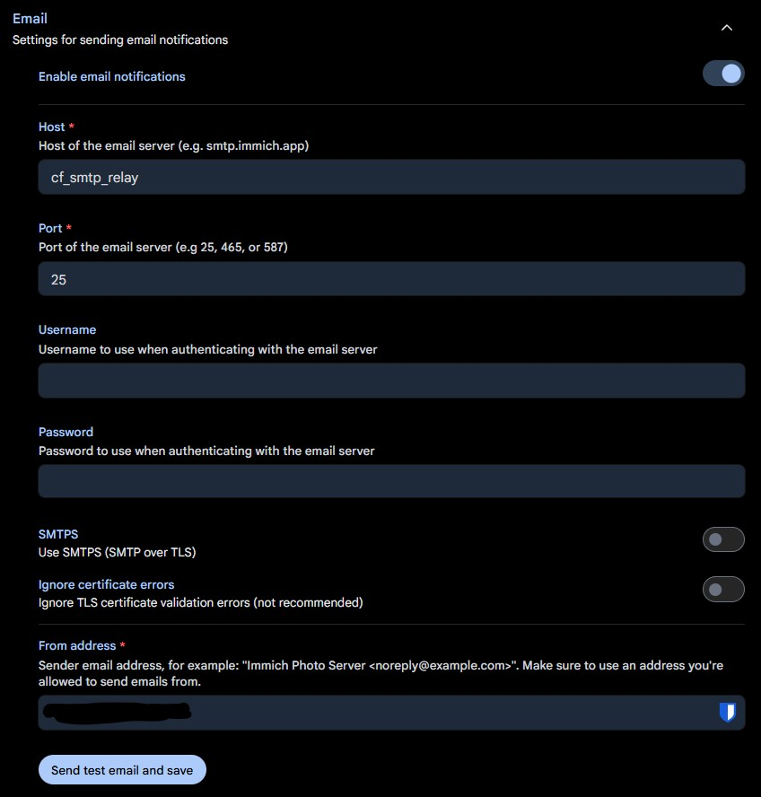

A tiny, self-hosted **SMTP-to-Cloudflare-Email-API bridge**, written in Go and shipped as a Docker image. Point your self-hosted apps (Immich, Vaultwarden, Gitea, Nextcloud, …) at it like any normal SMTP relay — under the hood it forwards every message to [Cloudflare Email Service](https://developers.cloudflare.com/email-service/) over HTTPS instead of talking to a real mail relay.

> ✅ Status: **MVP implemented (v0.1.0)**. The SMTP relay, Cloudflare API forwarding, config validation, logging, tests, container image build, and release automation are implemented. See [Roadmap / Milestones](#roadmap--milestones) for what is next.

## Why this exists

Most self-hosted software only knows how to *send* mail via SMTP, but running or paying for a full SMTP relay (Sendgrid, Postmark, a real Postfix box, …) is overkill if your domain already sits on Cloudflare DNS. Cloudflare Email Service lets you send transactional email with a single authenticated HTTPS request — no SMTP credentials, no port 25/587 exposure, no separate provider account. This project is the missing adapter: a tiny local SMTP endpoint your existing apps can already talk to, translating each accepted message into one Cloudflare REST call.

## How it works

```
┌─────────────┐   SMTP (25/587/2525)   ┌───────────────┐   HTTPS REST   ┌────────────────────────┐
│ Self-hosted │ ─────────────────────▶ │  cf-smtp-relay │ ─────────────▶ │ Cloudflare Email Service│
│ app (Immich,│                        │  (this repo)   │                │  /email/sending/send    │
│ Vaultwarden)│ ◀───────────────────── │                │ ◀───────────── │                          │
└─────────────┘   SMTP response codes  └───────────────┘  success/error  └────────────────────────┘
```

1. The relay speaks just enough SMTP to accept `EHLO`/`MAIL FROM`/`RCPT TO`/`DATA`/`QUIT` from a local client.
2. The `DATA` payload (a raw RFC 5322 message) is parsed with Go's standard `net/mail` / `mime` / `mime/multipart` packages to extract `From`, `To`, `Subject`, plain-text and HTML bodies, and attachments.
3. The parsed message is converted into a single `POST https://api.cloudflare.com/client/v4/accounts/{account_id}/email/sending/send` call.
4. Cloudflare's response (`delivered` / `queued` / `permanent_bounces` / `errors`) is mapped back to an SMTP status code and returned to the sending app.

## Core dependencies

Kept deliberately short — stdlib first, third-party only where it earns its place:

| Package | Purpose |
|---|---|
| [`github.com/emersion/go-smtp`](https://github.com/emersion/go-smtp) | SMTP server protocol state machine (stdlib only has an SMTP *client*) |
| [`github.com/spf13/viper`](https://github.com/spf13/viper) | Configuration binding — env vars only for now, but leaves the door open for a config file later without a rewrite |
| [`github.com/urfave/cli/v3`](https://github.com/urfave/cli/v3) | CLI scaffolding: `serve` / `version` subcommands, flags, and built-in `--version` handling |

Everything else — message parsing, the Cloudflare HTTP call, logging — stays in the standard library (`net/mail`, `mime`, `mime/multipart`, `net/http`, `log/slog`).

## Features

**Implemented (MVP / Milestone 1)**
- Minimal SMTP server: `EHLO`, `MAIL FROM`, `RCPT TO`, `DATA`, `QUIT`
- **No authentication** — the relay trusts whatever can reach it on the Docker network by design (see [Design decisions](#design-decisions))
- Single recipient, plain-text + HTML body, `Subject`
- Forwarding via the Cloudflare Email Sending REST API
- On transient Cloudflare errors (`429`/`5xx`), the relay returns an SMTP temporary-failure code immediately and lets the sending app's own retry logic handle it — **no internal retry queue in the MVP**
- Env-var-only configuration (12-factor style), no config file, bound via `viper`
- CLI scaffolding via `urfave/cli/v3` (e.g. `cf-smtp-relay serve`, `cf-smtp-relay version`)
- Version, git commit, and build time compiled in via `-ldflags` and printed at startup (and via `version`/`--version`)
- Structured JSON logging via `log/slog`
- Graceful shutdown on `SIGTERM`/`SIGINT`
- Multi-stage Dockerfile → distroless, non-root, published to `ghcr.io`

**Planned next (later milestones — see [Roadmap](#roadmap--milestones))**
- Multiple recipients, `Cc`/`Bcc`, custom headers, attachments (≤ 5 MiB total, matching Cloudflare's limit)
- Local retry queue with backoff for transient Cloudflare errors, if real-world usage shows the "let the client retry" approach isn't enough
- `/healthz` endpoint + Prometheus metrics
- Cross-platform release binaries (linux/darwin/windows, amd64/arm64) via GoReleaser
- Multi-domain / multi-Cloudflare-account routing
- Optional STARTTLS / SMTP `AUTH`, only if the relay ever needs to run somewhere less trusted than an internal Docker network

## Non-goals

- **Not** a general-purpose MTA. It doesn't receive mail, doesn't queue indefinitely, and doesn't sign DKIM itself — that's handled by Cloudflare once your sending domain is onboarded.
- No spam filtering, no mailing-list management, no bounce webhook processing (may become a stretch goal).

## Prerequisites

1. A domain on **Cloudflare DNS**, onboarded for **Email Service → Email Sending** in the Cloudflare dashboard (Cloudflare auto-adds the SPF/DKIM/DMARC and bounce-routing DNS records).
2. A **Cloudflare API Token** scoped to Email Sending only (least privilege).
3. Your **Cloudflare Account ID**.

## Quick start

```bash
docker run -d \
  --name cf-smtp-relay \
  -e CF_API_TOKEN=xxxxxxxxxxxxxxxx \
  -e CF_ACCOUNT_ID=xxxxxxxxxxxxxxxx \
  -e SMTP_HOSTNAME=mail.internal \
  -e SMTP_LISTEN_ADDR=0.0.0.0:2525 \
  -p 2525:2525 \
  ghcr.io/dhcgn/cf-smtp-relay:latest
```

```yaml
# docker-compose.yml
services:
  cf-smtp-relay:
    image: ghcr.io/dhcgn/cf-smtp-relay:latest
    restart: unless-stopped
    environment:
      CF_API_TOKEN: ${CF_API_TOKEN}
      CF_ACCOUNT_ID: ${CF_ACCOUNT_ID}
      SMTP_HOSTNAME: mail.internal
      SMTP_LISTEN_ADDR: 0.0.0.0:2525
      LOG_LEVEL: info
    networks:
      - internal   # keep this off any publicly exposed network

networks:
  internal:
```

Then point e.g. Immich at it: `SMTP_HOST=cf-smtp-relay`, `SMTP_PORT=2525`, no credentials required — the relay has no built-in auth by design, so keep it on the `internal` network only, with no published port.

Quick start above intentionally shows only the minimum runtime env vars for the relay itself.
It does not include extra variables used only by the user end-to-end test scripts.

## Immich sample

Example relay service for an Immich deployment:

```yaml
cf-smtp-relay:
  image: ghcr.io/dhcgn/cf-smtp-relay:latest
  container_name: cf_smtp_relay
  restart: unless-stopped
  environment:
    CF_API_TOKEN: ${CF_API_TOKEN}
    CF_ACCOUNT_ID: ${CF_ACCOUNT_ID}
    SMTP_HOSTNAME: mail.internal
    SMTP_LISTEN_ADDR: 0.0.0.0:25
    LOG_LEVEL: info
```

In Immich Admin -> Settings -> Notifications -> Email, use:

- Host: `cf_smtp_relay`
- Port: `25`
- Username: *(empty)*
- Password: *(empty)*
- STARTTLS/SMTPS: `off`
- Ignore certificate errors: `off`
- From address: one address using a domain/hostname you configured in Cloudflare Email Sending

Immich settings screenshot:



## Paperless-ngx sample (minimal)

Minimal Docker Compose example that only shows the SMTP-related parts for
Paperless-ngx with this relay. It assumes your existing compose already defines
the required `db` and `broker` services.

```yaml
services:
  cf-smtp-relay:
    image: ghcr.io/dhcgn/cf-smtp-relay:latest
    environment:
      CF_API_TOKEN: ${CF_API_TOKEN}
      CF_ACCOUNT_ID: ${CF_ACCOUNT_ID}
      SMTP_LISTEN_ADDR: 0.0.0.0:2525

  webserver:
    image: ghcr.io/paperless-ngx/paperless-ngx:latest
    depends_on:
      - db
      - broker
      - cf-smtp-relay
    environment:
      PAPERLESS_EMAIL_HOST: cf-smtp-relay
      PAPERLESS_EMAIL_PORT: 2525
      PAPERLESS_EMAIL_FROM: paperless@example.com
```

Paperless-ngx SMTP notes:

- Set `PAPERLESS_EMAIL_HOST` to the relay service name (`cf-smtp-relay`)
- Set `PAPERLESS_EMAIL_PORT` to the relay listener port (`2525` in this example)
- Keep SMTP auth disabled (no username/password), matching the relay's MVP trust model

## User end-to-end test

To quickly verify your setup from a real client flow, use the scripts in `user-end-to-end-test/`.

1. Copy `user-end-to-end-test/sample.env` to `user-end-to-end-test/.env` and fill your credentials.
2. Run one of the scripts below.

Required env vars differ by use case:
- Relay runtime (Quick start): `CF_API_TOKEN`, `CF_ACCOUNT_ID` (+ optional SMTP/log tuning vars)
- PowerShell e2e test: runtime vars + `EMAIL`, `FROM_EMAIL`
- Bash e2e test with Himalaya verification: PowerShell vars + `IMAP_*` (or set `E2E_HIMALAYA_CONFIG_PATH`)

### Windows (PowerShell)

```powershell
cd user-end-to-end-test
./run-e2e.ps1
```

What it does:
- Builds and runs `cf-smtp-relay` in Docker with your `.env`
- Sends a test email via `Send-MailMessage`
- Prints relay logs and cleans up the test container

### Linux (Bash + optional IMAP verification)

```bash
cd user-end-to-end-test
chmod +x ./run-e2e.sh
./run-e2e.sh
```

What it does:
- Builds and runs `cf-smtp-relay` in Docker with your `.env`
- Sends a test email through the local SMTP relay
- Verifies delivery with `himalaya` over IMAP (unless skipped)
- Prints relay logs and cleans up the test container

For full options and required environment variables, see `user-end-to-end-test/README.md`.

## Configuration

| Variable | Required | Default | Description |
|---|---|---|---|
| `CF_API_TOKEN` | ✅ | — | Cloudflare API token scoped to Email Sending. Treat as secret. |
| `CF_ACCOUNT_ID` | ✅ | — | Cloudflare account ID that owns the onboarded sending domain. |
| `CF_API_BASE_URL` | – | `https://api.cloudflare.com/client/v4` | Override for testing/mocking. |
| `SMTP_LISTEN_ADDR` | – | `:2525` | Address the local SMTP listener binds to. |
| `SMTP_HOSTNAME` | – | `localhost` | Hostname announced in the SMTP banner/EHLO response. |
| `SMTP_ALLOWED_SENDER_DOMAINS` | – | *(unset = allow all)* | Comma-separated allowlist of `From` domains, should match domains onboarded in Cloudflare. |
| `SMTP_MAX_MESSAGE_SIZE_BYTES` | – | `5242880` (5 MiB) | Matches Cloudflare's total message size limit; larger messages are rejected before calling the API. |
| `LOG_LEVEL` | – | `info` | `debug` \| `info` \| `warn` \| `error`. |
| `LOG_FORMAT` | – | `json` | `json` \| `text`. |
| `SHUTDOWN_TIMEOUT_SECONDS` | – | `10` | Grace period for in-flight connections on `SIGTERM`. |

There are deliberately no auth/TLS variables: the MVP has no built-in SMTP authentication and no config file, only environment variables (see [Design decisions](#design-decisions)).

## Error mapping: Cloudflare → SMTP

Cloudflare's REST API returns numeric error codes; the relay maps these to SMTP reply codes so sending applications retry (or give up) the way they normally would against a real MTA:

| Cloudflare code | Meaning | SMTP mapping (implemented) |
|---|---|---|
| `10004` (429, throttled) | Rate limit exceeded | `450 4.7.1` — temporary, client should retry |
| `10100` (503, upstream auth) | Auth service unavailable | `451 4.4.2` — temporary |
| `10002` / `10003` (500) | Internal / not implemented | `451 4.4.2` — temporary |
| `10101` / `10102` / `10103` (401/403) | Bad or unauthorized token | `550 5.7.1` — permanent, logged loudly for the operator (not a client-fixable problem) |
| `10203` (403, sending disabled) | Domain/account not enabled for sending | `550 5.7.1` — permanent |
| `10200` (400, too big) | Message exceeds size limit | `552 5.3.4` — permanent |
| `10001` / `10201` / `10202` (400) | Malformed request/content | `550 5.6.0` — permanent |

Any other/unrecognized Cloudflare error code (including undocumented codes) falls back to a classification by HTTP status: `429` → `450 4.7.1` (temporary), `>= 500` → `451 4.4.2` (temporary), `401`/`403` → `550 5.7.1` (permanent, logged loudly), `400`/`404` → `550 5.6.0` (permanent), anything else (including network-level failures with no Cloudflare status at all) → `451 4.4.2` (temporary).

In the MVP, every one of these mapped codes is returned straight to the connecting app — there's no internal retry queue yet, so a `450`/`451` simply means "your app should try again," the same as it would against any other flaky MTA.

## Design decisions

- **Why not 100% Go standard library?** Go's standard library ships an SMTP *client* (`net/smtp`) but no SMTP *server*. Per the project's own preference for native packages first, the relay uses stdlib wherever it can — `net/mail`, `mime`, `mime/multipart` for message parsing, `net/http` for the Cloudflare call, `log/slog` for logging — but relies on [`github.com/emersion/go-smtp`](https://github.com/emersion/go-smtp) for the actual SMTP protocol state machine, since writing and hardening a spec-compliant SMTP server from scratch isn't a good use of MVP time.
- **Go 1.26**: built with Go 1.26, taking advantage of the default Green Tea garbage collector (lower GC overhead under many short-lived goroutines/connections) and the experimental goroutine-leak profiler (`GOEXPERIMENT=goroutineleakprofile` / `runtime/pprof` `goroutineleak`) in CI tests, given the connection-per-goroutine nature of an SMTP server.
- **Docker best practices applied**: multi-stage build (build stage with full Go toolchain → minimal `distroless` runtime stage), non-root user, no shell in the final image, `SIGTERM`-aware graceful shutdown, structured logs to stdout/stderr (12-factor), semantic version + `sha-<short>` image tags, multi-arch manifest (`linux/amd64`, `linux/arm64`) published via GitHub Actions to `ghcr.io`.
- **No built-in authentication**: the relay assumes it only ever sits on an internal, trusted Docker network (no published port), the same trust model already used by plenty of internal mail relays. This keeps the MVP small and avoids building credential storage/rotation before it's needed. If a future use case needs the relay reachable from somewhere less trusted, `AUTH`/STARTTLS becomes a real milestone rather than a day-one requirement.
- **No internal retry queue in the MVP**: transient Cloudflare errors are surfaced immediately as SMTP `4xx` codes, and the sending application's own delivery/retry logic is responsible for trying again — the same behavior it would already have against a temporarily unreachable real MTA. Whether to add a persistent local retry queue later is left open for M3, once it's clear from real usage whether client-side retries are good enough.
- **Env vars only, no config file**: keeps the MVP's surface area small and matches typical Docker/12-factor deployment; a config file can be reconsidered later if the env var list grows unwieldy.
- **`viper` for configuration binding**: even though the MVP only reads env vars, `viper` gives structured, validated binding (with defaults and type coercion) for free, and means adding a config file later (if ever needed) is a small change rather than a rewrite.
- **`urfave/cli/v3` for the CLI shell**: gives the binary a proper `serve` command plus a `version` command/flag with essentially no boilerplate, instead of hand-rolling flag parsing.
- **Version reporting**: `version`, `commit`, and `buildTime` are package-level `var`s in `main`, left as zero values (`"dev"`/`"none"`/`"unknown"`) for local builds and set via `-ldflags -X` in CI, then logged once at startup and exposed through the CLI's version output — the same pattern used by most Go CLI tools.
- **Attachments in the MVP**: attachments aren't supported until M2. If an incoming message has an attachment alongside a text/HTML body, the relay silently strips the attachment and forwards just the text/HTML (still `250 OK`), logging the drop at `warn` so it's visible to an operator under the default log level without blocking mail flow. A message with *no* text/HTML content at all (e.g. attachment-only) is rejected.
- **Single recipient enforcement**: `go-smtp`'s own `MaxRecipients: 1` setting rejects a second `RCPT TO` with `452 4.5.3` before the relay's own recipient-handling code is even invoked again — no need to hand-roll that check.

## Roadmap / Milestones

- [x] **M0 — Scaffolding**: repo layout (`cmd/`, `internal/`), `LICENSE`, `.github/workflows/build-test.yml` + `.github/workflows/release.yml`, `.github/copilot-instructions.md`, Dockerfile skeleton, this README.
- [x] **M1 — MVP** 🎯: minimal, unauthenticated SMTP listener (trusted network only), single-recipient plain/HTML forwarding to Cloudflare, immediate `4xx`/`5xx` on transient/permanent Cloudflare errors (no retry queue), env-var-only config, structured logging, graceful shutdown, multi-stage Docker image published to `ghcr.io` on tag push.
- [ ] **M2 — Message fidelity**: multiple recipients, `Cc`/`Bcc`, custom headers, attachments, size-limit enforcement with a clean SMTP rejection instead of a failed API call.
- [ ] **M3 — Hardening**: `/healthz`, Prometheus metrics, and a decision (backed by real usage) on whether a local retry queue with backoff is worth adding for `429`/`5xx` Cloudflare responses.
- [ ] **M4 — Distribution**: GoReleaser cross-platform binaries (linux/darwin/windows × amd64/arm64), SBOM + build provenance attestation for the Docker image, `docker-compose.yml` and example Kubernetes manifest in `/examples`.
- [ ] **M5 — Stretch**: multiple Cloudflare accounts/domains with per-sender routing, delivery-status reconciliation (via Cloudflare's queued/delivered/bounce data), simple CLI for sending a test message without a full SMTP client, and — only if ever needed — STARTTLS/SMTP `AUTH` for running outside a trusted network.

*(Track these checklist items in the repository as implementation progresses.)*

## Continuous integration & releases

Two workflows, kept deliberately separate:

- **`.github/workflows/build-test.yml`** — runs `gofmt`, `go vet`, `go build`, and `go test -race` on every push and pull request. **Markdown-only changes are ignored** (`paths-ignore: **/*.md`), so editing this README doesn't burn CI minutes or block on an unrelated build.
- **`.github/workflows/release.yml`** — triggered by pushing a `vX.Y.Z` tag (or manually via `workflow_dispatch`). Cross-compiles binaries for `linux/darwin/windows × amd64/arm64` with `version`/`commit`/`buildTime` baked in via `-ldflags`, attaches them to the GitHub Release, then builds and pushes a multi-arch (`linux/amd64`, `linux/arm64`) image to `ghcr.io` tagged with the semver, a `sha-<short>`, and `latest` (for non-prerelease tags).

## AI coding agents

This repo ships a [`.github/copilot-instructions.md`](.github/copilot-instructions.md) file for GitHub Copilot and similar AI coding agents. It restates the non-negotiable MVP constraints above (no auth, no retry queue, no config file, stdlib-first) so an agent doesn't quietly "improve" scope that was deliberately deferred — read it before letting an agent touch this repo.

## Project layout

```
cmd/cf-smtp-relay/     # main package: CLI wiring (urfave/cli/v3), version vars
internal/config/       # viper-backed configuration loading
internal/smtpserver/   # go-smtp server setup, SMTP <-> internal message mapping
internal/cfclient/     # Cloudflare Email Sending REST API client
```

## Development

```bash
git clone https://github.com/dhcgn/cf-smtp-relay.git
cd cf-smtp-relay

# plain local build (version/commit/buildTime default to "dev"/"none"/"unknown")
go build -o bin/cf-smtp-relay ./cmd/cf-smtp-relay

# build with version metadata, the same way release.yml does
VERSION=$(git describe --tags --always --dirty)
COMMIT=$(git rev-parse --short HEAD)
BUILD_TIME=$(date -u +%Y-%m-%dT%H:%M:%SZ)
go build -ldflags "-s -w -X main.version=$VERSION -X main.commit=$COMMIT -X main.buildTime=$BUILD_TIME" \
  -o bin/cf-smtp-relay ./cmd/cf-smtp-relay

# cross-compile example
GOOS=linux GOARCH=arm64 go build -o bin/cf-smtp-relay-linux-arm64 ./cmd/cf-smtp-relay
```

## Security considerations

- `CF_API_TOKEN` is a secret — inject via Docker secrets, an untracked `.env` file, or your orchestrator's secret store; never bake it into the image.
- Scope the Cloudflare API token to Email Sending only, on the specific account, nothing broader.
- The relay has **no built-in SMTP authentication, by design** — this is not a gap to be closed later, it's the chosen trust model. Never publish its port; keep it reachable only from the internal Docker network alongside the apps that use it (e.g. a dedicated `internal` compose network, no `ports:` mapping).

## License

MIT.

## Key decisions log

| Decision | Choice | Rationale |
|---|---|---|
| SMTP auth | None — trust the Docker network | Keeps MVP small; matches how many internal relays already operate |
| Cloudflare API downtime/rate-limit | Fail fast, no local retry queue (for now) | Simplest MVP behavior; sending apps already have their own retry logic |
| Configuration | Env vars only | 12-factor style, no config file to parse/validate |
| Config binding library | `viper` | Structured/validated env var binding, config file support possible later without a rewrite |
| CLI framework | `urfave/cli/v3` | Free `serve`/`version` subcommands and flag handling |
| SMTP server library | `go-smtp` | Stdlib has no SMTP server; hand-rolling DATA dot-stuffing/line-length/reply-code framing risks silently corrupting mail, which is worse than one extra dependency |
| Attachments before M2 | Silently strip, forward text/HTML, log at `warn` | Keeps mail flowing for the common case without a hard MVP dependency on attachment support, while staying visible to operators at the default log level |
| CI structure | Separate build-test (path-ignores `.md`) and tag-triggered release workflows | Docs edits don't trigger builds; releases stay tied to version tags |
